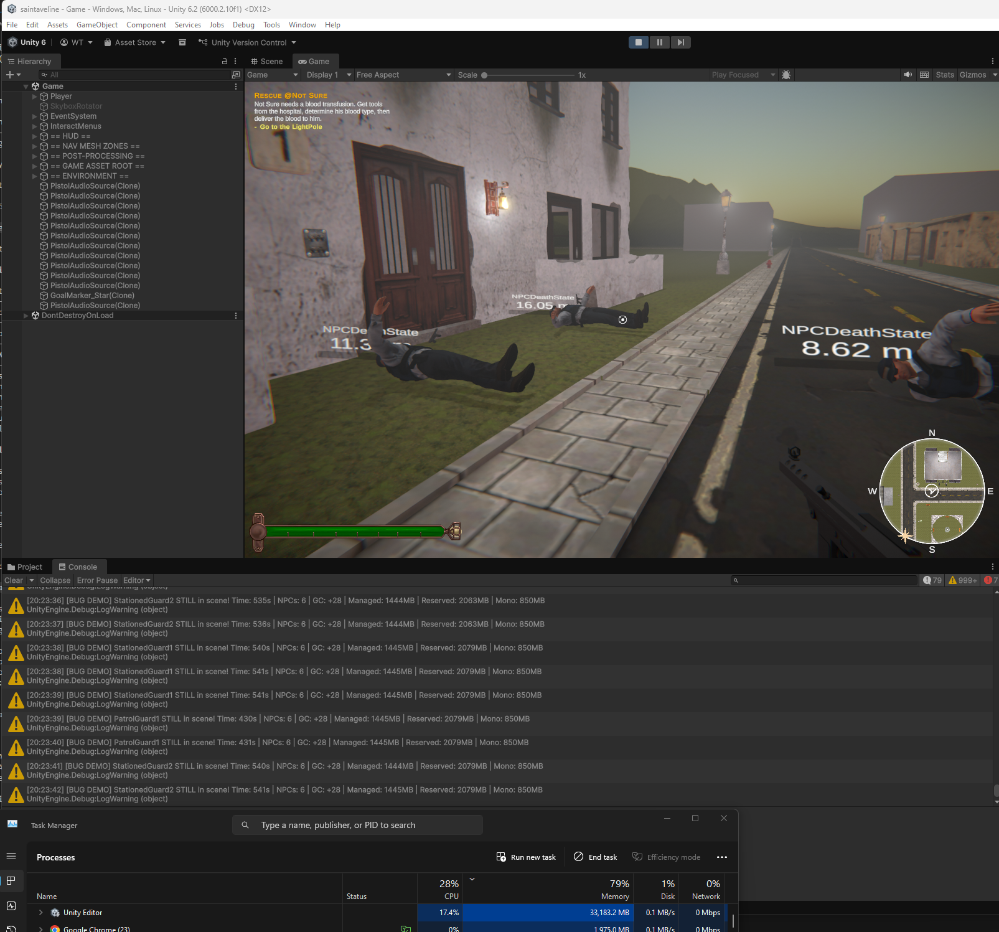
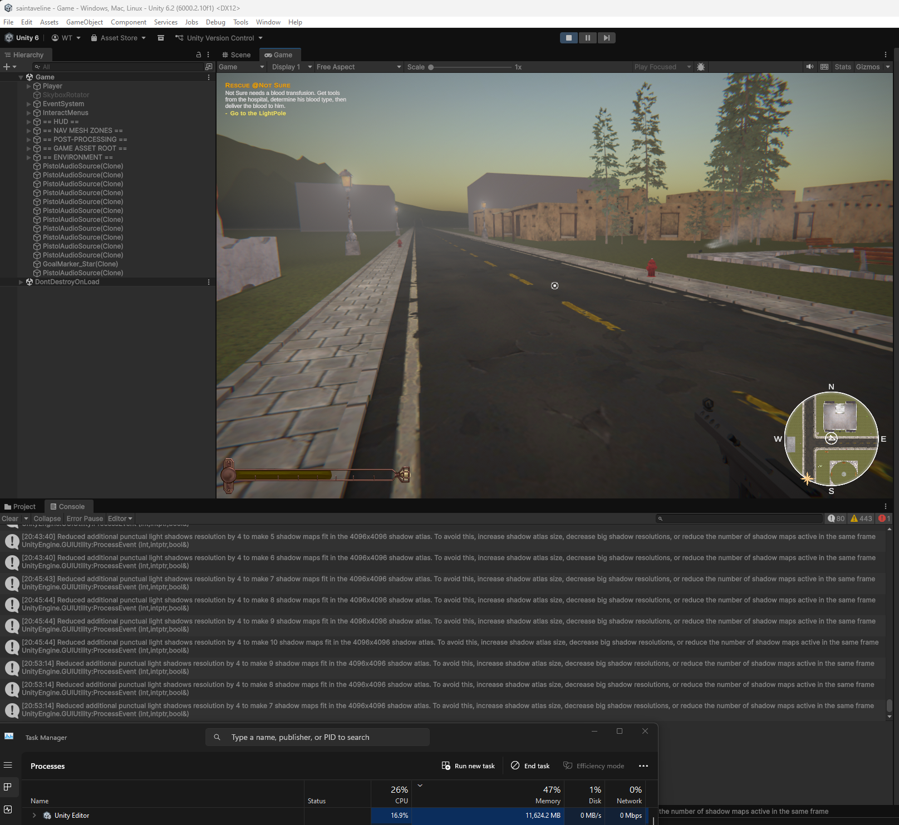

# NPC Death Fix Verification

## Summary

This document verifies that the fix in `fix/npc-destroy-memory` branch resolves the memory leak identified in the `demo/exception-spam` branch.

## Before vs After

### Before Fix (demo/exception-spam)



| Metric | Value |
|--------|-------|
| **Task Manager** | ~33,000 MB |
| **Time elapsed** | ~8-10 minutes |
| **Outcome** | Unity crash imminent |
| **Dead NPCs** | Visible, never destroyed |

### After Fix (fix/npc-destroy-memory)



| Metric | Value |
|--------|-------|
| **Task Manager** | ~3,000-4,000 MB (stable) |
| **Time elapsed** | Similar duration |
| **Outcome** | Stable, no crash |
| **Dead NPCs** | Properly fade and destroy |

## Improvement

| Metric | Before | After | Improvement |
|--------|--------|-------|-------------|
| **Peak memory** | ~33 GB | ~4 GB | **~88% reduction** |
| **Memory growth rate** | ~70 MB/sec | Stable | **Eliminated** |
| **NPC cleanup** | Never | After 12 sec | **Fixed** |
| **Crash risk** | Certain | None | **Resolved** |

## The Fix

Two files changed (+14/-8 lines total):

### NPCDeathState.cs

```csharp
// Before: Only finds MeshRenderer (returns null for animated NPCs)
var renderer = this.NPC!.GetComponent<MeshRenderer>();

// After: Finds any renderer type (SkinnedMeshRenderer, MeshRenderer)
var renderer = this.NPC!.GetComponentInChildren<Renderer>();
if (renderer == null)
{
    yield return new WaitForSeconds(_fadeDuration);
    UnityEngine.Object.Destroy(NPC.gameObject);
    yield break;
}
```

### NPCDebugHUD.cs

```csharp
// Added null guards to prevent exceptions when references become invalid
if (_thisNPC == null || _playerTransform == null) return;

// Safe null-conditional access for state machine
var currentState = _thisNPC.StateMachine?.CurrentState;
StateText.text = currentState?.GetType().Name ?? "<Unknown State>";
```

## Why It Works

1. **`GetComponentInChildren<Renderer>()`** - Base `Renderer` class matches both `SkinnedMeshRenderer` (animated NPCs) and `MeshRenderer`

2. **Null fallback** - If no renderer found, still waits and destroys (graceful degradation)

3. **`Destroy()` always called** - Native resources (GPU, NavMesh, Physics, Audio) properly released

4. **NPCDebugHUD guards** - Prevents per-frame exceptions that could contribute to overhead

## Conclusion

The fix resolves the native memory leak by ensuring `Destroy(NPC.gameObject)` is always called when NPCs die. Memory usage remains stable at normal levels (~3-4GB) instead of growing unboundedly to crash levels (~33GB).

---

*Verification conducted 2026-01-14*
